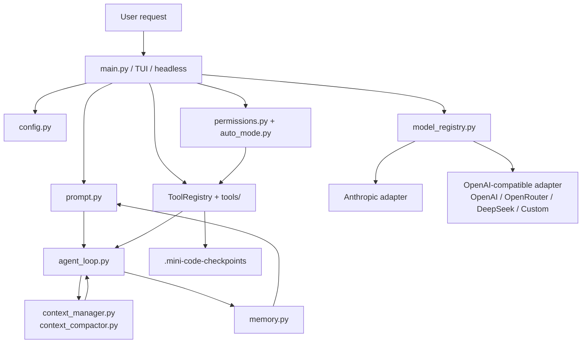

# MiniCode Python

A local Python coding agent for reading code, planning changes, editing files, running development commands, managing context pressure, and explaining its own workflow.

[中文说明](./README.zh-CN.md) | [学习文档](./学习文档.md) | [项目介绍](./项目介绍.md)

## What This Fork Adds

This repository is a learning fork built on top of MiniCode Python. It keeps the original local coding-agent idea, then adds several features that make the project easier to study and safer to operate:

- Plan mode: use `/plan` to let the agent inspect the project and produce an implementation plan before it is allowed to edit files or run non-read-only commands.
- Execution mode: use `/execute` to return to normal reviewed execution after you approve the plan.
- Checkpoints: MiniCode-managed file edits create workspace-local snapshots under `.mini-code-checkpoints/`, and `/checkpoint rollback <id>` can restore previous file states.
- Explainable context compaction: context management now reports an L1/L2/L3 strategy instead of acting like a black box.
- DeepSeek support: DeepSeek direct API is supported through the existing OpenAI-compatible adapter with `DEEPSEEK_API_KEY` and `https://api.deepseek.com`.
- Beginner-facing documentation: [学习文档.md](./学习文档.md) explains how the agent is assembled step by step; [项目介绍.md](./项目介绍.md) explains the module design and engineering flow.

## Public Open-Source Ideas Referenced

- [Cline](https://github.com/cline/cline): Plan/Act workflow, human-reviewed edits, checkpoints, and broad provider support.
- [Roo Code](https://github.com/RooCodeInc/Roo-Code): mode-oriented workflows such as Code, Architect, Ask, and Debug.
- [Aider](https://github.com/Aider-AI/aider): Git-friendly recovery thinking and the idea that AI edits should be easy to diff and undo.
- [OpenHands](https://github.com/OpenHands/OpenHands): agent runtime as a composable system with CLI, SDK, and local GUI surfaces.
- [DeepSeek API Docs](https://api-docs.deepseek.com/): OpenAI-compatible API configuration and current DeepSeek model access.

## Quick Start

```bash
python -m pip install -e .[dev]
python -m minicode.main
```

Set a model provider before real model calls. For DeepSeek:

```bash
set DEEPSEEK_API_KEY=sk-...
set MINI_CODE_MODEL=deepseek-v4-flash
python -m minicode.main
```

PowerShell example:

```powershell
$env:DEEPSEEK_API_KEY = "sk-..."
$env:MINI_CODE_MODEL = "deepseek-v4-flash"
python -m minicode.main
```

## Important Commands

| Command | Purpose |
| --- | --- |
| `/plan` | Switch to read-only planning mode. |
| `/execute` | Switch back to normal execution mode. |
| `/mode` | Show current permission mode and statistics. |
| `/mode plan` | Switch mode explicitly. |
| `/checkpoint list` | List saved checkpoints. |
| `/checkpoint show <id>` | Inspect one checkpoint. |
| `/checkpoint rollback <id>` | Restore files to the state captured before a MiniCode-managed edit. |
| `/context` | Show context status; the compactor reports L1/L2/L3 responsibilities. |
| `/model deepseek` | List DeepSeek direct API models. Prefer `deepseek-v4-flash` / `deepseek-v4-pro`; legacy `deepseek-chat` and `deepseek-reasoner` are kept for compatibility. |

## Architecture



## Verification

The changed Python modules compile with:

```bash
python -m py_compile minicode/auto_mode.py minicode/permissions.py minicode/cli_commands.py minicode/checkpoints.py minicode/model_registry.py minicode/config.py
```

The test suite uses the optional dev dependency:

```bash
python -m pip install -e .[dev]
python -m pytest tests/test_permissions.py tests/test_cli_commands.py tests/test_checkpoints.py tests/test_context_compactor.py tests/test_config.py -q
```

## Repository Lineage

- Main MiniCode project: [LiuMengxuan04/MiniCode](https://github.com/LiuMengxuan04/MiniCode)
- MiniCode Python base: [QUSETIONS/MiniCode-Python](https://github.com/QUSETIONS/MiniCode-Python)
- This repository: a learning fork focused on source reading, documentation, and cautious local-agent upgrades.
