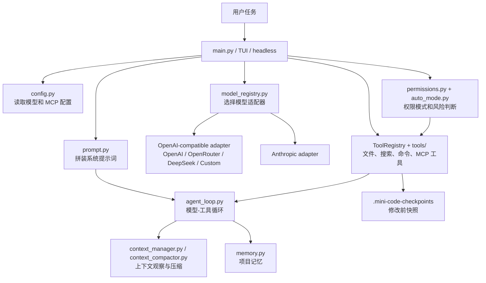

# MiniCode Python

一个本地 Python Coding Agent：它可以阅读代码、搜索文件、生成方案、修改文件、运行开发命令、管理上下文压力，并把自己的工作流程解释给使用者看。

[English](./README.md) | [学习文档](./学习文档.md) | [项目介绍](./项目介绍.md)

## 这个 fork 新增了什么

这个仓库是在 MiniCode Python 基础上的学习型 fork。它保留“本地 Coding Agent”的核心结构，并增加了几项更适合学习和安全使用的能力：

- 计划模式：输入 `/plan` 后，Agent 只能读文件、搜索代码、分析项目、输出方案，不能直接改文件或运行非只读命令。
- 执行模式：用户认可方案后，输入 `/execute`，Agent 才回到普通执行模式。
- checkpoint 回滚：由 MiniCode 工具管理的文件修改会在写入前保存快照，存到 `.mini-code-checkpoints/`，可以用 `/checkpoint rollback <id>` 恢复。
- 可解释三层上下文压缩：上下文管理不再只是“悄悄删历史”，而是解释 L1/L2/L3 分别保留什么。
- DeepSeek 适配：通过 OpenAI-compatible adapter 支持 DeepSeek 直连 API，配置 `DEEPSEEK_API_KEY` 和模型名即可使用。
- 教学文档：[学习文档.md](./学习文档.md) 用“我们如何一步步搭一个本地 Coding Agent”的方式讲源码；[项目介绍.md](./项目介绍.md) 讲模块设计、工程流程和测试/harness 思路。

## 借鉴了哪些公开开源项目

- [Cline](https://github.com/cline/cline)：借鉴 Plan/Act 工作流、人工审核文件修改、checkpoint 可回退、多模型适配这些产品设计。
- [Roo Code](https://github.com/RooCodeInc/Roo-Code)：借鉴“不同模式对应不同工作方式”的设计，比如 Code、Architect、Ask、Debug。
- [Aider](https://github.com/Aider-AI/aider)：借鉴“AI 修改要能被 Git diff、管理、撤销”的工程思路。
- [OpenHands](https://github.com/OpenHands/OpenHands)：借鉴把 Agent 做成可组合运行时的思路，CLI、SDK、GUI 都围绕同一个 agentic runtime。
- [DeepSeek API Docs](https://api-docs.deepseek.com/)：DeepSeek 官方提供 OpenAI-compatible API，本项目采用这条路径接入，并优先使用当前 V4 模型。

## 快速开始

```bash
python -m pip install -e .[dev]
python -m minicode.main
```

DeepSeek 配置示例：

```powershell
$env:DEEPSEEK_API_KEY = "sk-..."
$env:MINI_CODE_MODEL = "deepseek-v4-flash"
python -m minicode.main
```

也可以写入 `~/.mini-code/settings.json`：

```json
{
  "model": "deepseek-v4-flash",
  "env": {
    "DEEPSEEK_API_KEY": "sk-..."
  }
}
```

## 常用命令

| 命令 | 作用 |
| --- | --- |
| `/plan` | 进入只读计划模式。 |
| `/execute` | 回到默认执行模式。 |
| `/mode` | 查看当前权限模式和统计。 |
| `/mode plan` | 显式切换到 plan 模式。 |
| `/checkpoint list` | 查看已有 checkpoint。 |
| `/checkpoint show <id>` | 查看某个 checkpoint 保存了哪些路径。 |
| `/checkpoint rollback <id>` | 回滚到某次 MiniCode 工具修改前的文件状态。 |
| `/context` | 查看上下文状态，包含 L1/L2/L3 三层解释。 |
| `/model deepseek` | 查看 DeepSeek 直连 API 模型。推荐 `deepseek-v4-flash` / `deepseek-v4-pro`；`deepseek-chat`、`deepseek-reasoner` 仅作为兼容旧配置保留。 |

## 运行流程



## 验证

本次改动的核心模块已经通过语法编译：

```bash
python -m py_compile minicode/auto_mode.py minicode/permissions.py minicode/cli_commands.py minicode/checkpoints.py minicode/model_registry.py minicode/config.py
```

如果本机安装了 dev 依赖，可以运行关键测试：

```bash
python -m pip install -e .[dev]
python -m pytest tests/test_permissions.py tests/test_cli_commands.py tests/test_checkpoints.py tests/test_context_compactor.py tests/test_config.py -q
```

## 项目来源

- MiniCode 主项目：[LiuMengxuan04/MiniCode](https://github.com/LiuMengxuan04/MiniCode)
- MiniCode Python 基础项目：[QUSETIONS/MiniCode-Python](https://github.com/QUSETIONS/MiniCode-Python)
- 当前仓库：用于学习源码、补充中文文档、谨慎实验本地 Coding Agent 能力。
