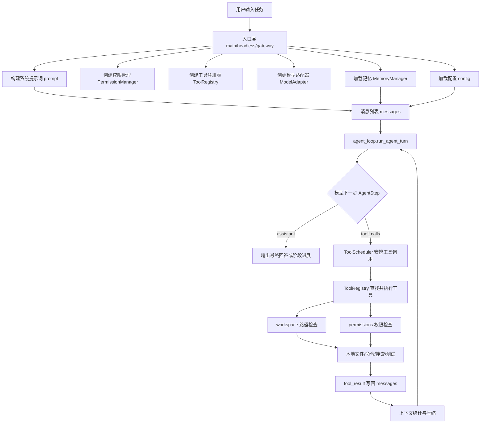

# MiniCode Python 项目介绍

这份文档是给初学者看的项目介绍。它不会只告诉你“这里有一个 API，那里有一个类”，而是按一个本地 Coding Agent 真正运行时的顺序来讲：用户输入任务以后，项目为什么要拆出这些模块，每个模块解决什么问题，源码在哪些文件里，最后这些模块如何协作成一个能读代码、改代码、跑命令、做测试、管理上下文的本地智能编程助手。

你可以把 MiniCode Python 理解成一个“有刹车、有记忆、有工具箱、有上下文预算意识”的本地 Coding Agent。它不是简单把用户问题转发给大模型，而是在本地构造了一个受控行动闭环：

```text
用户提出编程任务
  -> MiniCode 组织系统提示词、记忆、工具列表、权限规则
  -> 模型决定是直接回答，还是调用工具
  -> 本地工具执行读文件、搜索、写文件、跑命令、测试等动作
  -> 权限系统和工作区系统拦住危险操作
  -> 工具结果回到模型上下文
  -> 模型继续推理，直到给出最终结果
```

这个闭环，就是整个项目最核心的工程设计。

先给一个非常直接的结论：这个项目不是 Claude Code 本身，也还没有达到 Claude Code 那种成熟商业产品的完整程度。它更像是一个用 Python 写出来的“本地 Coding Agent 学习版运行时”：核心目标是让你看懂一个编程 Agent 怎么把模型、工具、权限、上下文、记忆、测试这些模块接到一起，并且能在本地项目里真实运行。

所以读这份文档时，可以先记住两句话：

- 如果从“能不能成为一个本地编程助手”看，MiniCode Python 已经具备 Coding Agent 的基本闭环：能读项目、调工具、改文件、跑命令、做权限控制、压缩上下文、接 MCP、做测试。
- 如果从“距离 Claude Code 还有多远”看，它还缺少很多产品级能力：更成熟的 IDE/终端体验、更强的权限和沙箱体系、更完整的子 Agent 工作流、更稳定的上下文与记忆策略、更丰富的插件生态、更严格的企业级策略管理。

## 1. 这是一个什么项目

MiniCode Python 是一个用 Python 实现的本地 Coding Agent 运行时。项目配置在 `pyproject.toml` 中，包名是 `minicode-py`，要求 Python `>=3.11`，并提供几个命令入口：

| 命令 | 源码入口 | 作用 |
| --- | --- | --- |
| `minicode-py` | `minicode.main:main` | 打开交互式本地 Coding Agent |
| `minicode-headless` | `minicode.headless:main` | 单次非交互执行，适合脚本或 CI |
| `minicode-gateway` | `minicode.gateway:run_gateway` | 启动一个简单 HTTP 网关 |
| `minicode-cron` | `minicode.cron_runner:main` | 定时任务运行入口 |

它的功能可以分成几类：

1. 读懂项目：通过 `read_file`、`grep_files`、`list_files`、`file_tree`、代码导航、代码审查等工具读取和分析本地代码。
2. 修改项目：通过 `write_file`、`edit_file`、`patch_file` 等工具修改文件，并在真正写入前经过权限和 diff 审查。
3. 运行项目：通过 `run_command`、`test_runner`、`git` 等工具执行命令、跑测试、查看版本状态。
4. 保持安全：通过 `PermissionManager` 和 `workspace.resolve_tool_path()` 限制越权路径、危险命令和文件编辑。
5. 先规划再执行：通过 `/plan` 进入只读计划模式，让 Agent 先读项目、搜代码、出方案；用户认可后再用 `/execute` 回到执行模式。
6. 修改后可恢复：通过 checkpoint 在 MiniCode 管理的文件修改前保存旧状态，必要时用 `/checkpoint rollback <id>` 回滚。
7. 管理上下文：通过 `ContextManager`、`ContextCompactor`、`ContextCyberneticsOrchestrator` 估算 token、自动压缩长对话，避免上下文爆掉。
8. 保留经验：通过 `MemoryManager`、记忆注入、反思写回，把项目习惯、历史决策、用户偏好带到后续任务。
9. 支持多种模型：通过模型适配层支持 Anthropic、OpenAI、OpenRouter、DeepSeek direct、Custom OpenAI-compatible endpoint、Mock。
10. 支持多种使用方式：交互式 TUI、headless 模式、HTTP gateway、会话恢复、MCP、Skills。
11. 用测试保证行为：通过大量 pytest 测试验证 Agent 循环、工具权限、上下文压缩、记忆、TUI、MCP 等模块。

所以一句话概括：MiniCode Python 是一个可以在本地项目里工作的编程智能体运行框架，它把“大模型会思考”和“本地代码能被安全操作”连接了起来。

### 1.1 它和 Claude Code 像在哪里，差在哪里

你可以把 Claude Code 理解成一个成熟的、官方产品级的本地/终端编程 Agent。Anthropic 的 [Claude Code Overview](https://docs.anthropic.com/en/docs/claude-code/overview) 把它描述成能读代码库、编辑文件、运行命令、接入开发工具的 agentic coding tool；[Claude Code SDK 文档](https://docs.anthropic.com/en/docs/claude-code/sdk) 也把 built-in tools、hooks、subagents、MCP、permissions、sessions 列为重要能力。也就是说，Claude Code 不只是“一个会聊天的模型”，而是一个已经产品化的开发工具系统。

MiniCode Python 和 Claude Code 像的地方，主要在“架构方向”上：

| 相似点 | Claude Code 的方向 | MiniCode Python 里的对应实现 |
| --- | --- | --- |
| 模型不是直接改文件，而是通过工具行动 | 工具调用驱动读文件、编辑、命令执行 | `ToolRegistry`、`ToolDefinition`、`tools/*` |
| 需要权限边界 | 编辑、命令、危险动作要受控 | `PermissionManager`、`AutoModeChecker`、`workspace.py` |
| 可以先规划再行动 | Plan/Act 类工作流 | `/plan`、`/execute`、`PermissionMode.PLAN` |
| 需要处理长上下文 | 会话长了要 compact | `ContextManager`、`ContextCompactor`、`/context` |
| 需要长期项目知识 | 项目规则和记忆影响后续任务 | `MemoryManager`、`.mini-code-memory/` |
| 可以接外部工具 | MCP、插件、外部服务扩展能力 | `mcp.py`、`.mcp.json`、MCP-backed tools |
| 需要测试 harness | Agent 行为要能复现和验证 | `ScriptedModel`、pytest、ablation harness |

差距也要说清楚。MiniCode Python 目前更适合学习和实验，Claude Code 更像一个经过长期产品化打磨的开发工具。

| 差距 | 当前 MiniCode Python 的情况 | 距离 Claude Code 类产品还差什么 |
| --- | --- | --- |
| 产品体验 | 有 CLI/TUI/headless/gateway，但整体体验还偏工程原型 | 更稳定的交互体验、IDE 集成、状态展示、错误提示和用户工作流 |
| 权限和沙箱 | 有路径、命令、编辑权限；有计划模式；但没有完整 OS 级沙箱 | 更强的系统级隔离、企业策略、细粒度 tool allow/deny、组织级配置 |
| 子 Agent | 有 `task` 工具和 explore/plan/general 类型，能把一个子任务放到隔离上下文里跑 | 更完整的 subagent 生命周期、多个会话并行、工具白名单治理、任务分发、结果汇总和可视化管理 |
| 上下文压缩 | 已经有基础压缩和可解释三层策略 | 更稳定的自动 compact 策略、更强的长期任务恢复、更自然的压缩说明 |
| 记忆系统 | 有 user/project/local 三层记忆和检索注入 | 更成熟的自动记忆、项目规则加载、记忆冲突处理和可审计策略 |
| 插件生态 | 支持 Skills 和 MCP，但生态和治理还有限 | 更完整的插件/skill 管理、市场生态、安装更新和安全审核 |
| 工程验证 | 测试很多，适合学习运行时边界 | 还需要更多端到端真实任务评测、跨平台稳定性验证和真实项目 benchmark |

所以这个项目的价值不是“复刻 Claude Code”，而是把一个本地 Coding Agent 的关键模块用 Python 摆在你面前，让你能读源码、跑测试、改功能、理解工程取舍。它已经有 Agent 的骨架和一些关键能力，但距离 Claude Code 这种完整工具，还有产品化、安全治理、生态、稳定性、多会话协作和复杂任务能力上的差距。

## 2. 整体运行流程

先看一张总图：



这张图里最重要的点是：模型本身不会直接碰文件系统。模型只能提出“我要调用某个工具”，真正执行工具的是本地 Python 代码。工具执行前还要经过路径检查、权限检查、输出截断、上下文管理。这样设计的好处是：模型负责判断任务，代码负责控制边界。

## 3. 项目由哪几部分组成

从工程角度看，项目可以拆成十个部分。

| 部分 | 主要文件 | 解决的问题 |
| --- | --- | --- |
| 入口与运行时装配 | `minicode/main.py`、`minicode/headless.py`、`minicode/gateway.py` | 用户从哪里进入系统，以及如何把配置、模型、工具、权限、记忆装起来 |
| 内部协议 | `minicode/types.py` | 模型回答、工具调用、工具结果在项目内部用什么数据结构表达 |
| 模型适配层 | `minicode/model_registry.py`、`minicode/anthropic_adapter.py`、`minicode/openai_adapter.py`、`minicode/mock_model.py` | 屏蔽不同模型供应商差异，让 Agent 循环只面对统一接口 |
| Agent 主循环 | `minicode/agent_loop.py` | 决定“模型 -> 工具 -> 结果 -> 模型”的核心闭环如何跑 |
| 工具系统 | `minicode/tooling.py`、`minicode/tools/*` | 把读文件、写文件、搜索、跑命令、测试等能力包装成模型可调用工具 |
| 权限与工作区 | `minicode/permissions.py`、`minicode/workspace.py`、`minicode/file_review.py` | 防止越权访问、危险命令、误写文件 |
| 提示词、Skills、MCP、记忆 | `minicode/prompt.py`、`minicode/skills.py`、`minicode/mcp.py`、`minicode/memory.py` | 把项目规则、外部工具、长期记忆注入给模型 |
| 上下文管理 | `minicode/context_manager.py`、`minicode/context_compactor.py`、`minicode/context_cybernetics.py` | 估算上下文大小，压缩长对话，保留关键任务信息 |
| 会话与界面 | `minicode/session.py`、`minicode/tty_app.py`、`minicode/tui/*` | 交互显示、历史记录、会话恢复、自动保存 |
| 测试体系 | `tests/*` | 用可重复测试证明 Agent 行为、工具安全和模块边界 |

这些部分不是孤立存在的。比如用户让 Agent “修复一个测试失败”，入口层先创建工具和权限，主循环让模型决定读取哪些文件，工具系统执行读取和测试命令，权限层判断命令是否安全，上下文层控制输出大小，测试层保证这一整条链路不会因为未来改代码而破坏。

## 4. 入口层：把一个 Agent 运行环境装起来

为什么需要入口层？因为一个 Coding Agent 不是只有模型。它启动时必须知道当前工作目录、模型配置、可用工具、权限状态、历史记忆、用户偏好、上下文窗口等信息。入口层的任务就是把这些零件装成一个可以运行的系统。

交互式入口在 `minicode/main.py`。这个文件里可以看到一条很清楚的装配线：

```python
runtime = load_runtime_config(cwd)
tools = create_default_tool_registry(cwd, runtime=runtime)
permissions = PermissionManager(cwd, prompt=prompt_handler)
model = create_model_adapter(
    model=runtime.get("model", "") if runtime else "",
    tools=tools,
    runtime=runtime,
    force_mock=force_mock,
)
context_mgr = ContextManager(model=runtime.get("model", "default"))
memory_mgr = MemoryManager(project_root=Path(cwd))
```

这段代码在启动 `minicode-py` 时触发。它要解决的问题是：在用户真正输入任务之前，系统必须先准备好“能做事的环境”。`runtime` 决定用哪个模型，`tools` 决定模型能调用哪些本地工具，`permissions` 决定哪些操作需要用户批准，`context_mgr` 负责上下文预算，`memory_mgr` 负责把历史经验带入当前任务。

`headless.py` 是另一种入口。它不进入交互界面，而是只跑一轮任务：

```python
tools = create_default_tool_registry(cwd, runtime=runtime)
permissions = PermissionManager(cwd, prompt=None)
memory_mgr = MemoryManager(project_root=Path(cwd))
model = create_model_adapter(
    model=runtime.get("model", ""),
    tools=tools,
    runtime=runtime,
)
```

这里有一个很重要的设计细节：`PermissionManager(cwd, prompt=None)`。headless 模式没有人坐在终端前实时确认，所以如果遇到越权路径、危险命令、需要确认的编辑，它不能临时问用户，只能保守失败。这是本地 Agent 很重要的安全思路：没有确认能力时，不假装已经确认。

`gateway.py` 则把 headless 包了一层 HTTP 接口。`GET /health` 用来检查服务是否存活，`POST /run` 接收 JSON 里的 `prompt`，然后调用 `run_headless(prompt)`。它故意只用 Python 标准库，说明这个网关定位很轻：不是复杂 Web 服务，而是给外部平台留一个最小可用的桥。

## 5. 内部协议：让模型、工具、循环说同一种语言

为什么需要 `types.py`？因为 Agent 循环里会出现多种消息：系统提示词、用户输入、模型回答、模型进度、工具调用、工具结果。如果这些消息没有统一结构，后面的工具调度、上下文压缩、测试都会很乱。

`minicode/types.py` 里定义了几个核心类型：

```python
class ChatMessage(TypedDict, total=False):
    role: Literal[
        "system",
        "user",
        "assistant",
        "assistant_progress",
        "assistant_tool_call",
        "tool_result",
    ]
    content: str
    toolUseId: str
    toolName: str
    input: Any
    isError: bool
```

这表示项目里的消息不是随便写字符串，而是有角色的。比如：

- `system` 是系统规则和项目上下文。
- `user` 是用户任务，也包括 Agent 循环给模型追加的“继续/恢复”提示。
- `assistant` 是模型最终回答。
- `assistant_progress` 是模型阶段性进展。
- `assistant_tool_call` 是模型提出的工具调用。
- `tool_result` 是本地工具执行后的结果。

模型每一步输出用 `AgentStep` 表示：

```python
@dataclass(slots=True)
class AgentStep:
    type: Literal["assistant", "tool_calls"]
    content: str = ""
    calls: list[ToolCall] = field(default_factory=list)
    diagnostics: StepDiagnostics | None = None
```

这里的设计很克制：模型下一步只有两种可能，要么说话，要么调用工具。这样 Agent 主循环就容易写清楚，也容易测试。测试里可以手写一个 `ScriptedModel`，让它第一步返回工具调用、第二步返回最终回答，从而不依赖真实大模型也能验证完整流程。

## 6. 模型适配层：把不同模型变成统一接口

为什么需要模型适配层？因为 Anthropic、OpenAI、OpenRouter、自定义 OpenAI-compatible 服务的 API 格式都不一样。如果主循环直接写这些差异，`agent_loop.py` 会变得非常复杂。

项目在 `minicode/model_registry.py` 里定义统一模型信息和路由逻辑：

```python
@dataclass
class ModelInfo:
    name: str
    provider: Provider
    context_window: int = 128_000
    max_output_tokens: int | None = None
    supports_streaming: bool = True
    supports_tools: bool = True
    pricing_input: float = 3.0
    pricing_output: float = 15.0
```

这里不只是记录模型名字，还记录上下文窗口、是否支持工具、是否支持流式、价格信息。为什么这些信息重要？因为 Coding Agent 跑起来以后会遇到不同压力：任务复杂时需要更强模型，上下文很长时需要更大窗口，预算紧张时要倾向便宜模型，工具调用任务则必须选择支持 tools 的模型。

内置模型里可以看到常见上下文窗口：

| 模型类别 | 典型上下文窗口 |
| --- | --- |
| Claude Sonnet 4 / Opus 4 | 200,000 tokens |
| Claude Haiku 3 | 100,000 tokens |
| GPT-4o / GPT-4o-mini / GPT-4-turbo | 128,000 tokens |
| o1 / o3-mini | 200,000 tokens |
| Gemini 2.5 Pro / Flash、部分 OpenRouter 模型 | 1,000,000 tokens |
| 默认 fallback | 128,000 tokens |

`ModelSelectionController` 会根据任务复杂度、预算压力、延迟压力、失败次数、是否需要长上下文等信号打分。这个模块体现了一个工程思路：模型不是越强越好，而是要和当前任务的风险、成本、时延匹配。

当前版本还加入了 DeepSeek direct provider。也就是说，DeepSeek 不再只能通过 OpenRouter 这类中转服务进入项目，也可以直接用 DeepSeek 官方 OpenAI-compatible API：

```text
deepseek-v4-flash
  -> detect_provider() = Provider.DEEPSEEK
  -> build_provider_config() 读取 DEEPSEEK_API_KEY / deepseekApiKey
  -> create_model_adapter() 复用 OpenAIModelAdapter
```

这里的重点不是“又多写了一个模型名字”，而是“新增 provider 不应该污染主循环”。DeepSeek API 格式兼容 OpenAI，所以项目没有新写一套 `DeepSeekAdapter`，而是把 DeepSeek 的 `base_url` 和 `api_key` 映射到已有的 `OpenAIModelAdapter`。这样做的好处是：工具 schema、tool call 解析、工具结果回填这些成熟逻辑都能复用。

截至 2026-06-10，项目里推荐使用 `deepseek-v4-flash` 和 `deepseek-v4-pro`；`deepseek-chat`、`deepseek-reasoner` 仍然注册，是为了兼容旧配置和旧教程，不是推荐新项目优先使用旧模型名。

## 7. Agent 主循环：项目真正“活起来”的地方

`minicode/agent_loop.py` 是整个项目的核心。用户任务进入以后，真正推动“模型思考、工具执行、继续恢复”的就是 `run_agent_turn()`。

函数签名里能看到它接收的关键对象：

```python
def run_agent_turn(
    *,
    model: ModelAdapter,
    tools: ToolRegistry,
    messages: list[ChatMessage],
    cwd: str,
    permissions: PermissionManager | None = None,
    store: Store[AppState] | None = None,
    max_steps: int = 50,
    context_manager: ContextManager | None = None,
    runtime: dict | None = None,
) -> list[ChatMessage]:
```

这段代码在用户提交一次任务时触发。它要解决的问题不是“调用一次模型”这么简单，而是持续管理一个回合内的所有状态：

- `current_messages` 保存当前模型能看到的上下文。
- `saw_tool_result` 记录是否已经执行过工具。
- `empty_response_retry_count` 记录空响应重试次数。
- `recoverable_thinking_retry_count` 记录可恢复 thinking 停止次数。
- `tool_error_count` 记录工具错误数量。
- `step` 控制最多运行多少步，避免无限循环。

Agent 循环的普通路径是：

```text
调用 model.next(messages)
  -> 如果返回 assistant：追加助手消息，结束或继续
  -> 如果返回 tool_calls：执行工具，追加 assistant_tool_call 和 tool_result
  -> 工具结果回到 messages，再调用 model.next(messages)
```

真正体现工程质量的是异常路径。比如模型返回空内容时，项目不会立刻崩掉，而是追加一个“你的上次响应是空的，请继续”的 nudge：

```python
if is_empty and empty_response_retry_count < 2:
    empty_response_retry_count += 1
    current_messages.append({
        "role": "user",
        "content": NUDGE_AFTER_EMPTY_RESPONSE
        if saw_tool_result
        else NUDGE_AFTER_EMPTY_NO_TOOLS,
    })
    continue
```

这段逻辑的设计意图是：模型 API 有时会因为工具调用、thinking block、输出截断等原因返回空文本。Agent 不应该把这种情况直接暴露给用户，而是先尝试把流程接回来。如果已经用过工具，就提示模型根据工具结果继续；如果还没用工具，就提示模型先开始分析或调用工具。

又比如模型因为 `pause_turn` 或 `max_tokens` 停在 thinking 阶段，项目会把它视作可恢复状态，追加 `RESUME_AFTER_PAUSE` 或 `RESUME_AFTER_MAX_TOKENS`，让模型继续。这种设计关注的是“流程恢复”，不是单纯捕获异常。

工具执行也被包在安全边界里。`_execute_single_tool()` 会设置超时，记录工具忙闲状态，并把普通异常转换成 `ToolResult(ok=False, output=...)`。这样一个工具失败不会直接炸掉整个 Agent，模型还可以看到错误结果，然后换一种方式继续。

## 8. 工具系统：模型不能直接操作本地，必须通过工具

为什么需要工具系统？因为大模型本身只能生成文本。要让它读文件、改文件、跑测试，就必须把这些本地动作封装成工具，并给每个工具定义输入格式、权限规则、输出格式和错误处理。

工具抽象在 `minicode/tooling.py`：

```python
@dataclass(slots=True)
class ToolDefinition:
    name: str
    description: str
    input_schema: dict[str, Any]
    validator: Validator
    run: Runner
    metadata: ToolMetadata | None = None
```

一个工具至少要说明五件事：

1. 它叫什么，模型如何引用它。
2. 它是干什么的，模型何时该用它。
3. 它接受什么输入，输入如何校验。
4. 它真正运行时做什么。
5. 它是否只读、是否危险、是否能并发。

`ToolRegistry` 负责注册和执行工具。源码里有一个 `_tool_index` 字典，用工具名做 O(1) 查找。这是一个小但很实用的工程优化：模型每轮可能调用很多工具，如果每次都线性搜索工具列表，代码简单但不够稳。

工具输出也会被统一处理。`tooling.py` 里有智能截断逻辑：大输出超过阈值后，读文件保留头尾，命令输出保留头尾和错误行，搜索结果保留前若干匹配。这样做是为了保护上下文窗口。一个 `pytest` 或 `grep` 输出可能很长，如果原样塞给模型，会把后面的推理空间挤没。

默认工具注册在 `minicode/tools/__init__.py`：

```python
def create_default_tool_registry(cwd: str, runtime: dict | None = None) -> ToolRegistry:
    skills = [asdict(skill) for skill in discover_skills(cwd)]
    mcp = create_mcp_backed_tools(
        cwd=cwd,
        mcp_servers=dict(runtime.get("mcpServers", {})) if runtime else {},
    )
    profile = _resolve_tool_profile(runtime)
    tools = list(_CORE_TOOLS)
    if _is_full_tool_profile(profile):
        tools.extend(_load_utility_wrapper_tools())
```

这段代码说明默认工具面板是“核心优先”的。常用工具直接加载，少用的 utility wrapper 只有在 full/utility/all profile 下才懒加载。这样可以减少模型工具面板的噪声，也减少启动成本。Skills 和 MCP 工具会被追加进同一个注册表，所以模型看到的是统一工具列表，不需要关心工具来自内置模块、技能目录还是外部 MCP 服务。

## 9. 典型工具设计：读文件与跑命令

读文件工具在 `minicode/tools/read_file.py`。它看起来简单，但里面体现了上下文友好的设计：

```python
DEFAULT_READ_LIMIT = 8000
MAX_READ_LIMIT = 20000
_FILE_CACHE_TTL = 2.0
```

`read_file` 默认只读 8000 个字符，最多 20000 个字符。如果文件没读完，输出头里会写：

```text
TRUNCATED: yes - call read_file again with offset ...
```

这段代码在模型想查看源码文件时触发。它解决的问题是：源码文件可能非常大，Agent 不能一次把整个文件塞进上下文。于是工具用 `offset` 和 `limit` 支持分段读取，并明确告诉模型下一次该从哪个 offset 继续。`prompt.py` 里也会提醒模型：如果 `read_file` 显示 `TRUNCATED: yes`，就继续读取，不要假装已经看完。

边界情况也有处理：`offset < 0` 会报错，`limit` 超过最大值会报错，二进制文件或编码失败会返回失败结果。这些错误不会让主循环崩掉，而是作为工具结果返回给模型，让模型换策略，比如用命令查看文件类型或读取其他文件。

跑命令工具在 `minicode/tools/run_command.py`。它比读文件更敏感，因为命令可能修改系统或删除文件。源码里有几个关键常量：

```python
COMMAND_TIMEOUT = 300
MAX_OUTPUT_CHARS = 200_000
```

命令默认最长执行 300 秒，输出最多保留 200,000 字符。同时它会识别：

- 常见只读命令，例如 `ls`、`pwd`、`rg`、`grep`、`cat`。
- 开发命令，例如 `git`、`npm`、`node`、`python`、`pytest`。
- shell 片段和危险 payload，例如 `rm -rf`、Windows 递归删除、`curl | sh`、PowerShell `iex`。

当命令未知、不是只读、或被识别为危险时，会调用：

```python
context.permissions.ensure_command(
    command,
    args,
    effective_cwd,
    force_prompt_reason=force_prompt_reason,
)
```

这就是“模型可以建议命令，但本地权限系统决定能不能执行”。比如模型想执行 `git reset --hard`，它必须经过权限确认；如果在 headless 模式没有 prompt，则会保守失败。这种设计是 Coding Agent 必须具备的安全边界。

## 10. 权限、工作区与文件审查：让本地操作可控

本地 Coding Agent 最大的风险不是回答错一句话，而是错误地改文件、删文件、跑危险命令。所以 MiniCode Python 专门把安全边界拆成三层。

第一层是工作区路径解析，位于 `minicode/workspace.py`。工具传入的相对路径会以当前工作目录为基准解析；如果目标路径逃出工作区，就要经过 `PermissionManager.ensure_path_access()`。没有权限管理器时，默认阻止越权路径。这保证模型不能随便读写工作区外的文件。

第二层是权限管理，位于 `minicode/permissions.py`。权限决策包括：

| 决策 | 含义 |
| --- | --- |
| `allow_once` | 只允许这一次 |
| `allow_turn` | 当前回合允许 |
| `allow_all_turn` | 当前回合允许所有编辑 |
| `allow_always` | 以后也允许，写入权限存储 |
| `deny_once` | 只拒绝这一次 |
| `deny_with_feedback` | 拒绝并给模型反馈 |
| `deny_always` | 永久拒绝，写入权限存储 |

危险命令分类在 `_classify_dangerous_command()` 中，例如：

- `git reset --hard` 会丢弃本地修改。
- `git clean` 会删除未跟踪文件。
- `git checkout --` 会覆盖工作区文件。
- `git push --force` 会改写远端历史。
- `rm -rf` 和磁盘格式化命令会造成灾难性数据丢失。
- `python`、`node`、`bash`、`powershell` 被视为可执行任意本地代码。

第三层是文件审查，位于 `minicode/file_review.py`。写文件不是直接覆盖，而是先读取旧内容、生成 unified diff、询问 `permissions.ensure_edit()`，确认后再写入。如果新旧内容没有变化，就返回 no-op。这让“改文件”从一个黑箱动作变成可审查动作：用户能看到改了什么，系统也能记录为什么允许。

当前版本里，权限层还新增了一个很关键的能力：计划模式。

### 10.1 之前是什么模式：默认执行模式

在没有计划模式之前，MiniCode Python 的主要工作方式可以理解成“默认执行模式”。用户输入一个任务后，Agent 会直接进入执行闭环：

```text
用户说：帮我修这个问题
  -> 模型读文件、搜索代码
  -> 如果判断需要修改，就调用 write_file/edit_file/patch_file
  -> 如果判断需要验证，就调用 run_command/test_runner
  -> 权限系统在具体写文件或跑危险命令前拦一下
```

注意，这里的“默认执行模式”不是完全不安全。它仍然有 diff 审查、路径检查、危险命令确认。但它的问题是：用户如果只是想“先看看项目、先出方案”，模型仍然可能在同一个任务里直接走到修改文件或运行命令。换句话说，旧模式的控制点在“具体动作发生前”，而不是在“整个任务阶段”上。

这对初学者很容易造成心理压力：我只是想让 Agent 先分析，它会不会一边分析一边改文件？虽然权限系统会拦住很多动作，但工作流本身还没有把“规划”和“执行”明确分开。

### 10.2 现在增强到什么情况：计划模式把任务分成 Plan 和 Execute

新增 `/plan` 后，项目多了一种明确的只读工作流。用户可以先输入：

```text
/plan
```

此时权限模式会切到 `PermissionMode.PLAN`。这个状态下，Agent 可以做这些事：

- 读文件：`read_file`
- 列目录：`list_files`
- 搜索代码：`grep_files`
- 看文件树：`file_tree`
- 做代码导航：`find_symbols`、`find_references`、`get_ast_info`
- 做只读代码审查：`code_review`
- 加载技能说明：`load_skill`
- 必要时向用户提问：`ask_user`

但它不能做这些事：

- 写文件：`write_file`、`edit_file`、`patch_file`
- 批量移动、复制、删除文件：`batch_move`、`batch_copy`、`batch_delete`
- 运行命令：`run_command`
- 默认调用未知 MCP 工具去做有副作用的事情

核心判断在 `minicode/auto_mode.py`：

```python
if self.mode == PermissionMode.PLAN:
    if tool_name in SAFE_TOOLS:
        return RiskAssessment(action="approve", reason="Plan mode: read-only tool")
    return RiskAssessment(action="block", reason="Plan mode: execution not allowed")
```

同时 `ToolRegistry.execute()` 也会在真正运行工具前做一次统一兜底：

```python
plan_block = self._blocked_by_plan_mode(tool_name, context)
if plan_block is not None:
    return plan_block
```

这两段代码配合起来，说明计划模式不是一句 prompt 提醒，而是运行时状态。模型如果遵守规则，它会读项目、搜代码、输出方案；模型如果忘了规则，直接请求 `batch_delete` 或 `write_file`，工具入口会返回失败结果，让模型知道“现在还不能执行”。

等用户看完方案、确认可以改，再输入：

```text
/execute
```

权限模式回到默认执行模式。此时 Agent 才能在原有 diff 审查、命令审批、路径边界的保护下执行修改和验证。

所以计划模式带来的增强可以这样理解：

| 对比点 | 之前默认执行模式 | 新增计划模式后 |
| --- | --- | --- |
| 任务阶段 | 分析和执行混在同一轮里 | 先 `/plan` 只读分析，再 `/execute` 执行 |
| 安全边界 | 具体写文件/危险命令前审批 | 整个计划阶段禁止副作用工具 |
| 用户心理预期 | 用户要靠语言说“先别改” | 用户用模式明确告诉 Agent “现在只能计划” |
| 工具访问 | 读工具、写工具、命令工具都可能被模型请求 | 只允许本地只读分析工具 |
| 工程实现 | `PermissionManager` 在具体动作前拦截 | prompt 提醒 + `AutoModeChecker` + `ToolRegistry` 统一兜底 |

这也是借鉴 Claude Code/Cline/Roo Code 这类工具时最值得学的一点：模式不是界面上的标签，而是工具访问范围的变化。只有工具范围真的变了，计划模式才有工程意义。

这三层协作起来就是：

```text
工具准备访问路径
  -> workspace 解析路径并检查是否逃出 cwd
  -> permissions 判断是否允许路径、命令或编辑
  -> file_review 对写入生成 diff 并请求确认
  -> checkpoint 保存修改前状态
  -> 真正执行本地操作
```

### 10.3 checkpoint：为什么权限通过以后还要能回滚

权限审查解决的是“这次能不能改”；checkpoint 解决的是“改完发现不对，能不能回去”。

当前版本新增了 `minicode/checkpoints.py`，并把它接到 `file_review.py` 和 `tools/batch_ops.py`。现在 MiniCode 管理的文件修改在真正落盘前，会先把旧状态保存到：

```text
.mini-code-checkpoints/<checkpoint-id>/metadata.json
.mini-code-checkpoints/<checkpoint-id>/files/*.bin
```

例如一次写文件的流程变成：

```text
准备写文件
  -> 读取旧内容
  -> 生成 diff
  -> 权限确认
  -> 创建 checkpoint
  -> 写入新内容
```

用户可以用：

```text
/checkpoint list
/checkpoint show <id>
/checkpoint rollback <id>
```

来查看和恢复 MiniCode 管理的文件修改。

这里要特别注意边界：checkpoint 只记录 MiniCode 文件工具造成的文件系统修改，不追踪任意 shell 命令的副作用。比如你让 `run_command` 执行一个外部脚本，它可能修改数据库、启动服务、访问网络，这些不是简单保存文件快照能安全恢复的。所以 checkpoint 是“文件工具的回滚机制”，不是完整系统级虚拟机快照。

## 11. 提示词、Skills、MCP 与记忆：让 Agent 知道项目规则

一个 Agent 能不能稳定工作，不只取决于模型能力，也取决于它启动时拿到了什么上下文。MiniCode Python 用几个模块把上下文组织起来。

`minicode/prompt.py` 负责构建系统提示词。它会把当前工作目录、权限摘要、可用 Skills、MCP servers、记忆上下文等信息组合进去。这样模型在第一轮就知道：我在哪里工作、能用哪些工具、哪些操作要小心、有哪些历史经验。

`minicode/skills.py` 负责发现项目技能。Skills 可以理解成“项目里额外提供给 Agent 的操作说明或能力包”。`tools/__init__.py` 会把发现到的 Skills 放进工具注册表的元信息里，让系统提示词可以描述它们。

`minicode/mcp.py` 负责 MCP 工具接入。它会校验 MCP server 命令，限制 shell 元字符，使用懒加载的 stdio client，并把 MCP 工具结果包装成统一 `ToolResult`。这意味着外部工具虽然来源不同，但进入 Agent 循环以后仍然遵守同一套工具协议。

`minicode/memory.py` 是长期记忆模块。文件开头的说明把记忆分成三层：

| 记忆层 | 位置 | 作用 |
| --- | --- | --- |
| 用户记忆 | `~/.mini-code/memory/` | 跨项目保存用户偏好和通用经验 |
| 项目记忆 | `.mini-code-memory/` | 当前项目共享的经验，可版本化 |
| 本地记忆 | `.mini-code-memory-local/` | 当前项目私有经验，不适合提交 |

记忆检索使用 TF-IDF 相关性评分，并会校验 memory JSON 结构。如果记忆文件损坏，代码会尝试备份坏文件并恢复有效条目。这个设计点很适合初学者理解：长期记忆不是“把所有历史都塞给模型”，而是先存起来，当前任务需要时再检索相关内容，最后注入提示词。

## 12. 上下文有多大，什么时候压缩，怎么压缩

这是用户特别关心的部分：在这个项目中，上下文是多大？什么时候开始压缩？怎么压缩？

基础上下文窗口在 `minicode/context_manager.py` 的 `DEFAULT_CONTEXT_WINDOWS` 中定义。几个关键值是：

| 模型 | 上下文窗口 |
| --- | --- |
| `claude-sonnet-4-20250514` | 200,000 tokens |
| `claude-opus-4-20250514` | 200,000 tokens |
| `claude-haiku-3-20240307` | 100,000 tokens |
| `gpt-4o` / `gpt-4o-mini` / `gpt-4-turbo` | 128,000 tokens |
| `o1` / `o3-mini` | 200,000 tokens |
| `google/gemini-2.5-pro` / `flash` | 1,000,000 tokens |
| `deepseek-v4-flash` / `deepseek-v4-pro` | 1,000,000 tokens |
| `default` | 128,000 tokens |

项目用粗略 token 估算来统计上下文大小：

- 英文和代码大约 4 个字符算 1 个 token。
- 中文、日文、韩文字符按更密集的比例估算。
- 每条消息还会按角色增加额外开销。

`ContextManager.get_stats()` 会算出总 token、系统提示词 token、对话 token、工具调用数量、使用百分比等。当使用率达到 80% 时，`is_near_limit=True`，用于提醒；当达到自动压缩阈值时，`should_compact=True`。

为了把这件事讲清楚，需要把当前项目里的上下文压缩分成两版来看。

### 12.1 第一版：基础上下文压缩，重点是“别爆窗口”

第一版压缩主要在 `minicode/context_manager.py` 的 `compact_messages()`。它解决的是最直接的问题：对话和工具结果太长了，模型窗口快塞不下了，怎么办？

普通自动压缩阈值是：

```python
AUTOCOMPACT_THRESHOLD = 0.95
```

也就是第一次通常到 95% 才压缩。但项目还有渐进压缩机制：

```text
第 0 级：95% 触发，压到 70%
第 1 级：85% 触发，压到 50%
第 2 级：75% 触发，压到 30%
第 3 级：60% 触发，更激进地提前压缩
```

为什么后面越来越激进？因为如果一个任务已经压缩过一次，说明它很可能是长任务。继续等到 95% 才处理，风险会更高，所以系统提前介入。

`compact_messages()` 的压缩顺序也很有设计感：

1. 永远保留 system prompt，因为系统规则不能丢。
2. 删除 `assistant_progress`，因为阶段性进度价值最低。
3. 截断特别大的 `tool_result`。读文件结果可以短一点，因为文件还能重读；编辑结果要保留更多，因为它证明了文件如何变化；错误结果也保留更多，因为错误信息对恢复很关键。
4. 把 `assistant_tool_call` 和紧跟的 `tool_result` 压成一句摘要，例如“读了哪个文件”“改了哪个文件”“跑了哪个命令”。
5. 如果还超预算，再按优先级删除旧消息，但至少保留 10 条消息，并保护最近 6 条消息。
6. 插入一条压缩标记 system message，记录压缩时间、移除数量、压缩前后 token 比例和被移除内容摘要。

第一版压缩可以理解成“上下文急救包”。它会尽量保留 system prompt、用户意图、最近消息和关键错误，把低价值内容删掉或压短。它的优点是简单直接，真正能减少 token；缺点是用户不太容易看懂：到底哪些东西还留在上下文里？哪些被压成摘要？大工具结果是丢了、截断了，还是能找回来？这些问题在第一版里解释得不够清楚。

所以第一版的核心目标是：

```text
不要超过模型窗口
  -> 删掉低价值 progress
  -> 截断大工具结果
  -> 压缩旧工具调用
  -> 必要时删除旧消息
```

它偏“内部机制”，能工作，但对初学者和用户不够透明。

### 12.2 第二版：可解释三层上下文策略，重点是“知道保留了什么”

第二版没有推翻第一版压缩，而是在它上面增加了更清楚的上下文治理管线。更高级的上下文管线在 `minicode/context_compactor.py`。它增加了几类优化：

| 机制 | 作用 |
| --- | --- |
| `ToolResultBudgetManager` | 大工具结果落盘，只在上下文保留预览 |
| `ReadDedupManager` | 同一个文件内容没变时，不重复塞入完整内容 |
| `MicrocompactEngine` | 定时清理旧工具结果，降低上下文成本 |
| `AutoCompactDispatcher` | 高水位自动压缩，优先尝试 session memory compact，再 full compact |
| `ReactiveCompactEngine` | API 报 context overflow 后做反应式恢复 |

这些机制解决的不是单纯“删多少 token”，而是“不同类型的信息应该放在哪里”。

第二版把上下文解释成三层：

| 层 | 放什么 | 为什么这样放 |
| --- | --- | --- |
| L1 Recent Working Context | 最近用户请求、最近工具结果、当前任务线索 | 这些是模型下一步最需要的，必须留在活上下文里 |
| L2 Session Summary | 旧对话压缩后的摘要、compact boundary | 旧历史不能全留，但重要决策和结论要变成摘要 |
| L3 Long-Term Memory And Artifacts | 项目记忆、大工具结果落盘文件、长期事实 | 不必每轮都塞进 prompt，需要时再检索或引用 |

源码里对应的是 `ContextCompactor.explain_layers()`：

```python
def explain_layers(self) -> str:
    return "\n".join([
        "Explainable Three-Layer Context Strategy",
        "L1 Recent Working Context: ...",
        "L2 Session Summary: ...",
        "L3 Long-Term Memory And Artifacts: ...",
    ])
```

用户执行 `/context` 时，不只看到“用了多少 token”，还会看到这三层分别承担什么：

```text
L1：最近现场还在活上下文里
L2：旧对话在高水位时会压成摘要
L3：长期记忆和大工具结果在磁盘上，需要时再拿回来
```

这对初学者很重要。因为“上下文压缩”听起来像把历史删掉，但真正合理的压缩不是乱删，而是搬家：

```text
最重要、马上要用的信息 -> 留在 L1
以前发生过、仍有参考价值的信息 -> 压成 L2 摘要
很大、长期、偶尔才用的信息 -> 放到 L3 磁盘/记忆
```

### 12.3 两版上下文压缩到底差在哪里

可以用一张表总结：

| 对比点 | 第一版基础压缩 | 第二版可解释三层策略 |
| --- | --- | --- |
| 主要目标 | 防止上下文超过模型窗口 | 防止爆窗口，同时解释信息被放到哪里 |
| 主要文件 | `context_manager.py` | `context_manager.py` + `context_compactor.py` |
| 触发方式 | 使用率到阈值后 compact | 高水位自动压缩、工具结果预算、重复读取去重、reactive recovery |
| 处理大工具结果 | 截断内容，保留头尾或摘要 | 大结果可以落盘，上下文只保留预览 |
| 处理重复读文件 | 主要靠普通消息压缩 | `ReadDedupManager` 用 hash 判断文件没变就不重复塞全文 |
| 对用户是否透明 | 用户只能看到压缩标记和 token 变化 | `/context` 能解释 L1/L2/L3 各自保留什么 |
| 恢复思路 | 压缩后继续让模型跑 | API 报 context overflow 时还可以 reactive compact 恢复 |

如果用生活化比喻，第一版像“书桌满了就扔掉一些纸、把一些纸折小”；第二版像“把资料分成桌面、文件夹、档案柜”：桌面放马上要用的，文件夹放摘要，档案柜放大文件和长期资料。第二版不是为了显得复杂，而是为了让长任务可解释、可恢复、可继续。

`context_cybernetics.py` 则进一步把上下文压缩做成控制系统：传感器观察使用率和增长趋势，PID 控制器以 0.70 左右为目标，预测器判断是否会溢出，然后选择压缩强度。初学者可以把它理解为“上下文空调”：不是等房间热炸了才开，而是持续测温、预测升温、自动调节。

## 13. Cybernetic Orchestrator：把运行时控制集中管理

项目 README 里强调 MiniCode Python 是 self-regulating coding agent，也就是会观察自己、调整自己。这个思想集中体现在 `minicode/cybernetic_orchestrator.py`。

为什么需要 orchestrator？因为 Agent 运行时会有很多控制器：上下文控制、成本控制、失败恢复、进度检测、模型选择、记忆注入、反思写回。如果这些控制器都直接散落在 `agent_loop.py` 里，主循环会变得难以维护。于是项目把它们集中到 `CyberneticOrchestrator`，主循环只调用高层生命周期钩子：

```text
initialize()
wire_memory()
wire_healing()
step_start()
step_end()
reflect_on_task()
```

在 `agent_loop.py` 里，任务开始时会创建 orchestrator，初始化反馈控制、前馈控制、稳定性监控、自愈、进度控制、模型选择、智能路由、反思等组件。每一步开始和结束时，orchestrator 收集状态并给出控制动作。比如上下文压力太高时触发压缩，工具错误增多时进入恢复路径，预算压力变大时收紧输出预算。

这背后的工程思路是：复杂 Agent 不应该只靠 prompt 祈祷模型表现好，而应该把运行过程中的信号测出来，再反馈给执行系统。

## 14. 会话、TUI 与多入口协作

交互式体验主要由 `minicode/tty_app.py` 和 `minicode/tui/*` 负责。TUI 模块不改变 Agent 的核心能力，它负责把输入框、工具进度、转录记录、状态提示等展示给用户。这样 UI 和核心运行时分离：界面可以变化，但真正执行任务的仍然是 `run_agent_turn()`。

会话持久化在 `minicode/session.py`。它解决的问题是：用户做一个长任务时，不能因为退出终端就丢掉所有上下文和历史。核心设计包括：

- 会话保存到 `~/.mini-code/sessions`。
- 自动保存间隔为 30 秒。
- 使用 delta 增量保存，只保存新消息和新 transcript。
- 每 10 个 delta 做一次 full save。
- 最多保留 50 个 delta，超过后强制整合。
- 用 session index 保存轻量元数据，方便列出和恢复会话。

这个模块和上下文管理不是一回事。上下文管理解决“当前发给模型的内容不能太大”；会话持久化解决“本地历史不能丢”。一个是运行时预算，一个是磁盘状态恢复。

## 15. 测试代码怎么测试 Agent，设计思路是什么

Agent 项目最难测试的地方在于：真实大模型输出不稳定，真实命令会改变环境，真实权限交互需要人工确认。MiniCode Python 的测试设计不是去测试“模型聪不聪明”，而是测试“运行时规则是否可靠”。

`tests/test_agent_loop.py` 里定义了 `ScriptedModel`：

```python
class ScriptedModel(ModelAdapter):
    def __init__(self, steps: list[AgentStep]) -> None:
        self._steps = steps
        self.calls = 0

    def next(self, messages: list[ChatMessage], on_stream_chunk=None) -> AgentStep:
        step = self._steps[self.calls]
        self.calls += 1
        return step
```

这个假模型按脚本返回固定步骤。比如测试“工具调用能执行并回到最终回答”时，第一步让模型返回 `tool_calls`，第二步返回 `assistant`：

```python
model = ScriptedModel(
    [
        AgentStep(
            type="tool_calls",
            calls=[{"id": "1", "toolName": "echo", "input": {"text": "hi"}}],
        ),
        AgentStep(type="assistant", content="done"),
    ]
)
```

这样测试不需要 API key，不受网络影响，也不会因为模型今天换一种说法就失败。它验证的是 Agent 主循环的合同：

- 工具调用会被执行。
- 工具结果会追加成 `tool_result`。
- 最终 assistant 消息能返回。
- progress、tool_start、tool_result、assistant callbacks 会触发。
- 空响应会被 nudge 重试。
- `pause_turn` 可以恢复。
- 多次空响应会生成 fallback。
- store 会传给模型适配器。
- registry dispose 会被调用。

`tests/test_tools.py` 和 `tests/test_permissions.py` 则测试安全边界。比如危险 shell 片段测试会 monkeypatch `subprocess.run` 和 `subprocess.Popen`：如果危险命令在权限确认前真的执行，测试会立刻失败。这种测试非常关键，因为它不是看函数返回值好不好看，而是证明“危险动作不能绕过权限系统”。

权限测试还会验证：

- 工作区外路径默认禁止。
- `deny_always` 会持久化，之后不再重复询问。
- `allow_always` 对危险命令会持久化。
- `allow_turn` 和 `allow_all_turn` 只在当前回合生效。
- Windows 路径匹配大小写不敏感。
- 危险命令分类器能识别多类破坏性操作。

所以测试体系在项目中的作用是：把 Agent 的行为边界固定下来。模型输出可以变化，但“工具怎么执行、权限怎么拦、上下文怎么恢复”必须稳定。

## 16. Harness：给 Agent 搭一个可控实验场

在 Agent 项目里，`harness` 可以先理解成“测试台”或“运行外壳”。它不是 Agent 的大脑，也不是某一个工具，而是一套把 Agent 放进可控环境里的工程设施：给它固定任务、固定输入、固定模型替身、固定权限策略和固定评估指标，然后观察它能不能按预期完成任务。

为什么 Agent 特别需要 harness？因为普通函数通常是“输入 A，返回 B”，很好测试；但 Agent 不一样，它会多轮思考、调用工具、读取文件、执行命令、修改代码，还会受到模型输出不稳定的影响。如果每次都用真实大模型和真实项目环境来测，就很难复现问题。Harness 的设计思路就是：把不可控的部分先控制住，让我们能稳定验证 Agent 的运行机制。

这个项目里的 harness 主要有三层。

第一层是 Agent 主循环测试 harness。`tests/test_agent_loop.py` 里的 `ScriptedModel` 就是一个非常典型的例子。它不调用真实 LLM，而是按脚本返回固定的 `AgentStep`：

```python
class ScriptedModel(ModelAdapter):
    def __init__(self, steps: list[AgentStep]) -> None:
        self._steps = steps
        self.calls = 0

    def next(self, messages: list[ChatMessage], on_stream_chunk=None) -> AgentStep:
        step = self._steps[self.calls]
        self.calls += 1
        return step
```

这段代码的设计意图是：测试 Agent 主循环时，不让真实模型的不确定性干扰结果。比如测试工具调用时，可以规定模型第一步一定返回 `tool_calls`，第二步一定返回 `assistant`。这样测试关心的就不是“模型今天怎么回答”，而是“Agent 收到工具调用后，是否真的执行工具、记录 `tool_result`、再把结果交回模型继续”。

第二层是运行模式 harness。`minicode/headless.py` 把 Agent 包成一次性执行模式，`minicode/gateway.py` 再把 headless 包成 HTTP 接口。它们的实际作用是让 Agent 不只在交互式终端里运行，也可以在脚本、CI、自动化平台或外部服务里运行。尤其是 headless 模式里 `PermissionManager(cwd, prompt=None)` 的设计很关键：没有交互确认能力时，危险操作不能假装被允许，而是要保守失败。

第三层是控制器评估 harness。`minicode/cybernetic_ablation.py` 文件开头直接写着 `Deterministic cybernetic-control ablation harness`。这里的 harness 用固定任务画像比较两种策略：一种是静态 baseline，一种是项目里的 cybernetic controllers。它不会真实调用模型，而是用本地、确定性的方式观察控制器行为，比如工具错误率、上下文峰值、验证强度、并发 worker 数、记忆注入模式、模型 effort、进度控制动作、风险等级等。

`CyberneticAblationRunner.run_from_harness()` 还能从 harness 任务目录加载任务画像，`load_harness_task_profiles()` 会寻找带 `oracle.json` 的任务目录，`load_harness_run_evidence()` 可以读取 `results.json` 或 `profile.json` 作为已有实验结果。也就是说，这里已经不只是单元测试，而是在做“同一批任务、同一套指标、对比不同控制策略”的实验平台。

它的实际作用可以总结成四点：

1. 让 Agent 行为可复现。用 `ScriptedModel`、`MockModelAdapter`、固定任务画像和 pytest fixture，把不稳定的大模型行为替换成可预测输入。
2. 让关键流程可验证。工具调用、权限拦截、空响应恢复、`pause_turn` 恢复、上下文压缩、记忆注入、orchestrator 生命周期都可以被单独验证。
3. 让安全边界可证明。`tests/test_tools.py` 和 `tests/test_permissions.py` 会 monkeypatch `subprocess.run` / `Popen`，如果危险命令在权限确认前执行，测试会直接失败。
4. 让控制策略可比较。`cybernetic_ablation.py` 可以把 baseline 和 cybernetic 策略放在同一组任务画像上对比，而不是凭感觉说“控制器更好”。

所以在这个项目里，harness 的意义不是“多写一些测试文件”这么简单。它更像是 Agent 的工程实验场：把 Agent 放进一个可控环境里，让开发者能观察它、约束它、比较它、复现它的问题，并逐步证明这个本地 Coding Agent 的运行机制是可靠的。

## 17. 一次完整任务如何在项目里流动

假设用户输入：“帮我找出测试失败原因并修复。”

第一步，入口层已经在 `main.py` 中准备好了模型、工具、权限、上下文、记忆和系统提示词。用户输入被追加到 `messages`。

第二步，`run_agent_turn()` 调用模型。模型可能先决定搜索测试文件，于是返回：

```text
tool_calls: grep_files(pattern="pytest", path="tests")
```

第三步，Agent 主循环把这次调用记录为 `assistant_tool_call`，再交给 `ToolRegistry.execute()`。工具系统校验输入，工作区解析路径，权限系统确认路径在 cwd 内，然后执行搜索。

第四步，搜索结果作为 `tool_result` 回到 `messages`。如果输出太大，工具系统会先截断；如果上下文压力大，`ContextCompactor` 可能把旧工具结果压缩或落盘。

第五步，模型看到搜索结果后，可能继续读某个测试文件。`read_file` 默认读 8000 字符。如果文件没读完，结果里会提示 `TRUNCATED: yes` 和下一个 offset。模型应该继续分段读取，直到拿到足够上下文。

第六步，模型定位到源码文件，调用 `edit_file` 或 `patch_file`。写入前 `file_review.py` 生成 diff，`PermissionManager.ensure_edit()` 根据用户选择决定是否允许。

第七步，模型调用 `run_command` 或 `test_runner` 跑测试。命令如果是安全测试命令，可以执行；如果包含危险 shell 片段，会触发权限确认或保守失败。

第八步，如果测试失败，错误输出作为 `tool_result` 回到模型。模型根据错误调整补丁，再跑一次。这个循环持续到模型给出最终回答，或者达到 `max_steps`，或者遇到不可恢复错误。

整个过程中，模型负责“下一步该做什么”，本地运行时负责“这一步能不能做、怎么做、结果如何记录、失败怎么接回来”。

## 18. 当前版本借鉴了哪些公开资源

当前版本没有使用任何泄露源码。它借鉴的是公开 GitHub 项目和官方文档里的产品/架构思路，然后用 MiniCode Python 自己的代码结构实现。

| 公开资源 | 借鉴的设计思路 | 落到本项目哪里 |
| --- | --- | --- |
| [Cline](https://github.com/cline/cline) | Plan/Act 工作流、人工审核、checkpoint、多模型支持 | `/plan`、`/execute`、checkpoint、DeepSeek provider |
| [Roo Code](https://github.com/RooCodeInc/Roo-Code) | 不同模式对应不同工具权限和工作方式 | `PermissionMode.PLAN`、`/mode`、只读工具白名单 |
| [Aider](https://github.com/Aider-AI/aider) | AI 修改应该可 diff、可审查、可撤销，适合 Git 工作流 | `file_review.py`、`checkpoints.py`、写入前 diff |
| [OpenHands](https://github.com/OpenHands/OpenHands) | Agent runtime 应该是可组合系统，不只是一段 prompt | main/headless/gateway 共用工具、模型、权限、上下文模块 |
| [Claude Code Overview](https://docs.anthropic.com/en/docs/claude-code/overview) / [SDK](https://docs.anthropic.com/en/docs/claude-code/sdk) | 成熟 Coding Agent 不只是聊天，而是工具、权限、会话、MCP、hooks、subagents 的组合系统 | 本文用它作为“差距参照”，不把 MiniCode 说成已经等同于 Claude Code |
| [DeepSeek API Docs](https://api-docs.deepseek.com/) | DeepSeek 提供 OpenAI-compatible API | `Provider.DEEPSEEK` 复用 `OpenAIModelAdapter` |

这些借鉴点的共同思路是：不要只让模型“口头上变谨慎”，而要把谨慎落实成运行时机制。计划模式要真的限制工具，checkpoint 要真的保存旧状态，上下文压缩要真的解释保留了什么，多模型适配要真的收束到统一 adapter。

## 19. 工程设计思路总结

MiniCode Python 的核心设计可以总结成六句话。

第一，模型和本地副作用隔离。模型不能直接读写文件，只能通过工具请求动作；工具层、权限层、工作区层决定动作是否执行。

第二，所有能力都走统一协议。无论是内置工具、Skills 还是 MCP 工具，最终都变成 `ToolDefinition` 和 `ToolResult`，主循环不用关心它们来自哪里。

第三，错误是流程的一部分。空响应、暂停、max_tokens、工具失败、上下文溢出都不是简单崩溃，而是通过 nudge、fallback、reactive compact、自愈控制尝试恢复。

第四，上下文是一种预算。项目不会无限塞工具输出，而是统计 token、截断输出、去重读取、落盘大结果、逐级压缩，并保留 system prompt、用户意图、最近消息和关键错误。

第五，长期经验不等于长上下文。记忆被分层存储、检索、注入，而不是每次把所有历史塞进 prompt。

第六，测试验证运行时合同。测试不依赖真实大模型，而是用脚本模型、mock 权限、monkeypatch subprocess 来证明核心流程和安全边界可靠。

再把这份文档开头的问题收回来：

- 这是一个什么项目？它是一个 Python 本地 Coding Agent 学习版运行时，能把大模型、工具、权限、上下文、记忆、测试连接成一个可运行闭环。
- 它有哪些核心功能？读代码、搜代码、改文件、跑命令、权限审核、计划模式、checkpoint 回滚、上下文压缩、长期记忆、MCP 扩展、多模型适配、测试 harness。
- 距离 Claude Code 差在哪里？它已经有架构骨架和关键机制，但产品体验、沙箱能力、subagent 成熟度、上下文/记忆稳定性、插件生态、真实任务评测和企业级治理还远不如 Claude Code。

所以更准确地说，MiniCode Python 不是“Claude Code 复制品”，而是一个适合学习和继续升级的 Coding Agent 工程样板。它让你能看到一个 Agent 从入口、模型、工具、权限、上下文、记忆到测试是怎么串起来的。

## 20. 如何运行与验证

在项目根目录可以安装开发环境：

```bash
python -m pip install -e .[dev]
```

启动交互式 Agent：

```bash
minicode-py
```

运行一次 headless 任务：

```bash
python -m minicode.headless "解释 minicode/agent_loop.py 的主流程"
```

启动 HTTP 网关：

```bash
minicode-gateway
```

运行测试：

```bash
pytest -q
```

如果你是初学者，建议不要一上来读所有文件。可以按这条路线：

```text
pyproject.toml
  -> README.md
  -> minicode/main.py
  -> minicode/types.py
  -> minicode/model_registry.py
  -> minicode/tooling.py
  -> minicode/tools/read_file.py
  -> minicode/tools/run_command.py
  -> minicode/permissions.py
  -> minicode/workspace.py
  -> minicode/file_review.py
  -> minicode/agent_loop.py
  -> minicode/context_manager.py
  -> minicode/context_compactor.py
  -> tests/test_agent_loop.py
  -> tests/test_tools.py
  -> tests/test_permissions.py
```

这条路线的好处是先看“项目怎么启动”，再看“消息怎么表达”，再看“工具怎么执行”，最后看“复杂流程怎么被测试证明”。读完以后，你会更容易理解 MiniCode Python 为什么不是一个普通 CLI，而是一个完整的本地 Coding Agent 运行时。
